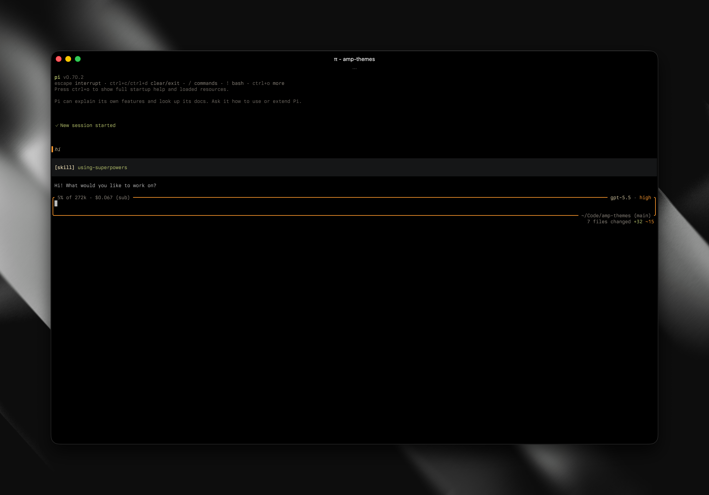

# amp-themes

Amp-inspired UI suite for [Pi](https://pi.dev): a dark theme, custom editor chrome, and compact tool display bundled as one installable package.



## What it includes

- `themes/amp-gruvbox-dark-hard.json` — dark Amp-style Pi theme.
- `extensions/amp-editor.ts` — rounded bottom editor chrome with context usage, real session cost, model id, thinking level, cwd, git branch, and an external git change summary.
- `extensions/amp-user-message.ts` — compact Amp-style user message rendering with a leading status bar.
- Amp-style static working indicator and `Working...` message.
- `pi-tool-display` — compact tool rendering loaded from this package so users get a complete UI setup with one install.

## Install from npm

After this package is published:

```bash
pi install npm:amp-themes
```

Then select the theme in Pi settings, or set this in `~/.pi/agent/settings.json`:

```json
{
  "theme": "amp-gruvbox-dark-hard"
}
```

If you already have `npm:pi-tool-display` installed separately, remove that separate package entry to avoid loading the same tool renderers twice. This package bundles and loads `pi-tool-display` from `node_modules/pi-tool-display/index.ts`.

## Local development install

```bash
cd /Users/frank/Code/amp-themes
npm install
pi install /Users/frank/Code/amp-themes
```

This repo includes `.npmrc` with `legacy-peer-deps=true` because `pi-tool-display@0.3.3` currently declares Pi `^0.68.1` peers while newer Pi versions are compatible in practice.

Verify package loading without changing global Pi settings:

```bash
npm run check
```

Or with mise:

```bash
mise run install
mise run check
mise run pack-check
```

## Editor layout

Top left:

```text
<context percent> of <context window> · <real cost>
```

Top right:

```text
<model id> · <pi.getThinkingLevel()>
```

Bottom right border:

```text
<cwd> (<git branch>)
```

Below the editor, right-aligned when the repo has changes:

```text
<files changed> files changed +<added> ~<modified> -<removed>
```

The diff counts use the active theme's `toolDiffAdded`, `warning`, and `toolDiffRemoved` colors.

The editor keeps a 2-line minimum body when empty, then grows with multi-line input using Pi's native editor behavior.

Command autocomplete remains below the editor for now and is only indented to match the Amp-like layout.

## Cost display

The editor does not hard-code money. It mirrors Pi's footer accounting by summing assistant message usage from:

```ts
ctx.sessionManager.getEntries()
```

For each assistant message it adds:

```ts
entry.message.usage.cost.total
```

If the current provider uses OAuth/subscription auth, the label appends `(sub)` via:

```ts
ctx.modelRegistry.isUsingOAuth(ctx.model)
```

If no real cost exists and the model is not subscription-backed, the cost segment is hidden.

## Repository structure

```text
amp-themes/
  package.json
  README.md
  extensions/
    amp-editor.ts
    amp-user-message.ts
  themes/
    amp-gruvbox-dark-hard.json
  screenshots/
    amp-gruvbox-dark-hard.png
```

## Release checklist

```bash
npm install
npm run typecheck
npm run release:check
npm publish
```

The npm package bundles `pi-tool-display`, so `npm pack --dry-run` should list one bundled dependency.

See `CHANGELOG.md` for release notes.

## License

MIT
